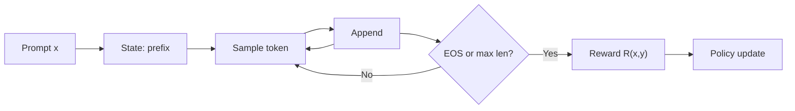
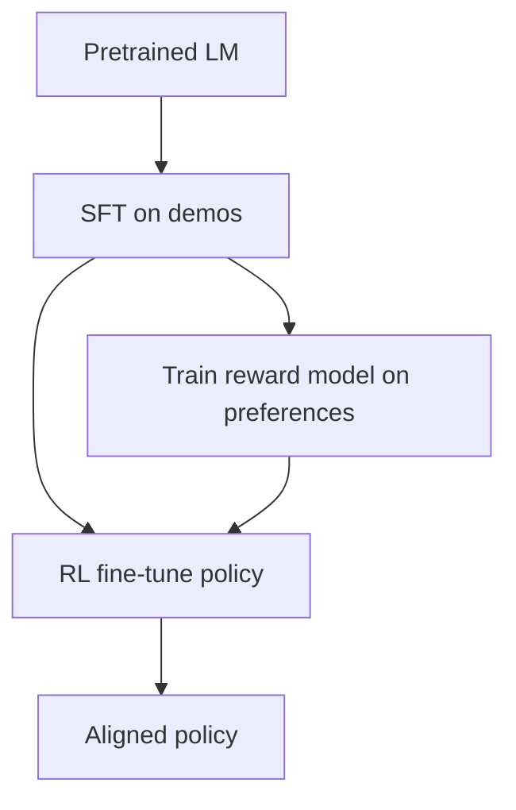

# Reinforcement Learning for Generative Models

Supervised training of generative networks maximizes likelihood of observed samples. That objective is misaligned with many deployment goals — preference, safety, task success, or sample quality under a non-differentiable metric. **Reinforcement learning (RL)** treats the generator as a policy and optimizes expected reward, which is how modern LLM alignment (RLHF) and several image/video fine-tuning pipelines work.

**Prerequisites:** policy gradients / REINFORCE at a first-course level; autoregressive or diffusion generative models. **Scope:** how RL is *used* to train generative NNs (especially language models), not a full RL textbook. Actor–critic theory, offline RL, and multi-agent RL are out of scope except where they appear in practice.

## Why leave maximum likelihood?

Maximum likelihood (MLE / cross-entropy) for a generative model $p_{\theta}$ fits the training distribution:

$$
\theta^\star = \arg\max_{\theta}\thinspace \mathbb{E}\_{x \sim \mathcal{D}}\bigl[\log p_{\theta}(x)\bigr]
$$

Problems that show up in practice:

| Issue | Consequence |
|-------|-------------|
| **Proxy mismatch** | Human preference, win rate, or code-pass@k are not log-likelihood |
| **Exposure bias** | Teacher forcing trains on gold prefixes; at inference the model conditions on its own errors |
| **Mode covering** | MLE spreads mass over all training modes; often you want *preferred* modes |
| **Non-differentiable scores** | BLEU, compiler pass/fail, human rankings — no $\nabla_{\theta}$ through the scorer |

RL reframes generation as sequential decision-making and optimizes $\mathbb{E}[R]$ under a reward that can be sparse, learned, or black-box.

## Generation as an MDP

For an **autoregressive** model (LLM, pixelCNN-style decoder), one natural MDP is:

| MDP object | Generative reading |
|------------|--------------------|
| State $s_{t}$ | Prompt + tokens generated so far, $x_{<t}$ |
| Action $a_{t}$ | Next token $x_{t}$ from vocabulary $\mathcal{V}$ |
| Policy $\pi_{\theta}(a_{t} \mid s_{t})$ | Softmax over logits: $p_{\theta}(x_{t} \mid x_{<t})$ |
| Transition | Deterministic append: $s_{t+1} = (s_{t}, a_{t})$ |
| Reward $R$ | Usually **terminal** (end of sequence), sometimes shaped per step |

A trajectory is a full completion $y = (y_{1},\ldots,y_{T})$ given prompt $x$:

$$
\pi_{\theta}(y \mid x) = \prod_{t=1}^{T} \pi_{\theta}(y_{t} \mid x, y_{<t})
$$

The RL objective is expected reward (often with a KL penalty back to a reference policy $\pi_{\mathrm{ref}}$ — see below):

$$
J(\theta) = \mathbb{E}\_{x \sim \mathcal{D},\thinspace y \sim \pi_{\theta}(\cdot\mid x)}\bigl[R(x,y)\bigr]
$$

**Diffusion / flow** models can be cast similarly (denoising steps as actions), but the dominant industrial use of RL for generative models is still **token-level policies** with sequence-level rewards. The rest of this note focuses on that case.

## Policy gradient backbone

The score-function (REINFORCE) identity gives an unbiased gradient without differentiating through $R$:

$$
\nabla_{\theta} J(\theta) = \mathbb{E}\_{y \sim \pi_{\theta}}\Bigl[ R(x,y)\thinspace \nabla_{\theta} \log \pi_{\theta}(y \mid x) \Bigr]
$$

For autoregressive policies,

$$
\nabla_{\theta} \log \pi_{\theta}(y \mid x) = \sum_{t=1}^{T} \nabla_{\theta} \log \pi_{\theta}(y_{t} \mid x, y_{<t})
$$

so credit from a **sequence-level** reward is smeared across all tokens — high variance. Practical systems reduce variance with:

- **Baselines** $b(x)$: replace $R$ by $R - b$ (advantage-like)
- **Learned critics** $V_{\phi}(s_{t})$ (actor–critic / GAE as in PPO)
- **Group comparisons** of several samples for the same prompt (GRPO-style)

Importance sampling and clipping (PPO) keep updates from leaving the trust region of the data collected under an older policy $\pi_{\theta_{\mathrm{old}}}$.

## The RLHF stack (language models)

**RLHF** (reinforcement learning from human feedback) is the canonical pipeline for aligning generative LLMs after pretraining.

### 1. Supervised fine-tuning (SFT)

Start from a pretrained LM; fine-tune on high-quality (prompt, response) demos. This yields $\pi_{\mathrm{SFT}}$ — a competent but not preference-optimized policy. It also becomes the usual **reference** $\pi_{\mathrm{ref}}$ for the KL term.

### 2. Reward model from preferences

Collect pairwise (or ranked) human comparisons: for prompt $x$, prefer $y_{w}$ over $y_{l}$. Fit a scalar reward model $r_{\phi}(x,y)$ under a Bradley–Terry likelihood:

$$
p(y_{w} \succ y_{l} \mid x) = \sigma\bigl(r_{\phi}(x,y_{w}) - r_{\phi}(x,y_{l})\bigr)
$$

$r_{\phi}$ is typically another LM with a scalar head. Once trained, it stands in for the human as a **dense-enough** (still usually terminal) reward for RL.

### 3. RL fine-tuning with KL regularization

Optimize

$$
\begin{aligned}
J(\theta) ={}& \mathbb{E}\_{x,y \sim \pi_{\theta}}\bigl[r_{\phi}(x,y)\bigr] \\\\
&\quad - \beta\thinspace \mathbb{E}\_{x}\bigl[D_{\mathrm{KL}}\bigl(\pi_{\theta}(\cdot\mid x)\Vert \pi_{\mathrm{ref}}(\cdot\mid x)\bigr)\bigr]
\end{aligned}
$$

The KL term is not optional decoration: without it the policy **hacks** $r_{\phi}$ (gibberish that scores high, length gaming, reward-model exploits) and drifts from fluent language. Equivalently one maximizes expected **regularized** reward

$$
R_{\mathrm{eff}}(x,y) = r_{\phi}(x,y) - \beta \log\frac{\pi_{\theta}(y\mid x)}{\pi_{\mathrm{ref}}(y\mid x)}
$$

**PPO** has been the workhorse optimizer (clipped surrogate + value head). Alternatives that avoid an explicit online RL loop are discussed next.

## Preference optimization without an RL loop

If the goal is “match a preference distribution under KL to $\pi_{\mathrm{ref}}$,” the optimal policy has a closed form in terms of the reward. **Direct Preference Optimization (DPO)** and relatives rearrange that so you never train $r_{\phi}$ or run PPO: you optimize a classification-style loss on preference pairs directly in policy space.

| Method | What you train | Online sampling? |
|--------|----------------|------------------|
| **PPO-RLHF** | Reward model + policy (+ value) | Yes — on-policy rollouts |
| **DPO** | Policy only (implicit reward) | No — offline preference pairs |
| **GRPO / group relative** | Policy; advantages from group of samples | Yes — multiple completions per prompt |
| **Rejection sampling / RFT** | Filter high-reward samples, then SFT | Sampling, then supervised |

DPO is often enough for chat alignment; online RL (PPO/GRPO) still matters when the reward is **verifiable** (unit tests, math checkers, compilers) and you want the policy to explore beyond the preference dataset.

## Verifiable rewards and “RLVR”

A growing pattern for reasoning / code models: skip the learned reward model and use **ground-truth checkers** — pass/fail on unit tests, exact match on math, format constraints. Call this **RL with verifiable rewards (RLVR)** informally.

- Reward is sparse and objective → less reward hacking of a learned $r_{\phi}$, but still hacking of the checker (hardcoded answers, trivial programs).
- Group-relative methods (sample $K$ completions, normalize advantages within the group) fit well: no value network required.
- Process rewards (step-level) vs outcome rewards (final answer) trade annotation cost against credit assignment.

This is closer to classical RL (environment gives $R$) than to preference modeling, but the **policy is still a generative NN**.

## Image and other modalities (brief)

Same idea, different action space:

- **RL fine-tuning of text-to-image**: reward from human prefs, CLIP/aesthetic scorers, or downstream task metrics; policy may be the denoiser or a prompt/adapter.
- **Discrete latent policies** (VQ tokens) look like language-model RL again.
- **Diffusion RL** needs care: the generative process is a long denoising chain; many methods use truncated / single-step surrogates or optimize only late steps.

The conceptual map is unchanged: define $\pi_{\theta}$, define $R$, control divergence from a reference generator.

## Failure modes worth remembering

| Failure | Symptom | Mitigation |
|---------|---------|------------|
| **Reward hacking** | High $r_{\phi}$, worse humans | KL to $\pi_{\mathrm{ref}}$; refresh RM; verifiable $R$ |
| **Over-optimization** | Goodhart’s law on proxy | Early stop; mix SFT; evaluate offline prefs |
| **Mode collapse** | Low diversity, repetitive style | Entropy / KL bonuses; diverse prompts |
| **Length bias** | Verbose answers win | Length-normalize rewards; train RM carefully |
| **High variance** | Unstable PPO | Baselines, GAE, group advantages, larger batches |

## Practical mental model

1. **Pretrain / SFT** → fluent generative prior $\pi_{\mathrm{ref}}$.
2. **Define success** → human prefs, learned $r_{\phi}$, or verifiable checker.
3. **Optimize expected reward** under a **trust region** (KL / PPO clip / DPO implicit constraint).
4. **Evaluate** on held-out preferences and real tasks — the training reward is a proxy.

RL does not replace representation learning in the base model; it **steers** an already-capable generator toward objectives that likelihood training cannot express.

## Related notes

- [RL for Neural Posterior Estimation](./rl-neural-posterior-estimation.md) — same RL toolkit on the *outer* loop of simulation-based inference (proposals, active simulation, calibration rewards), not chat alignment.
- Statistical estimation and model misspecification show up the same way in circuit modeling proxies — optimize the metric you mean, then distrust it (no dedicated page yet).
- [Modified Nodal Analysis](../spice/modified-nodal-analysis.md) — unrelated domain, same habit: state the unknowns and the objective before choosing an optimizer.

**References (standard):** Sutton & Barto, *Reinforcement Learning*; Schulman et al., PPO; Christiano et al. / InstructGPT (RLHF); Rafailov et al., DPO.
