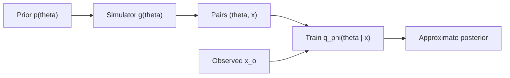
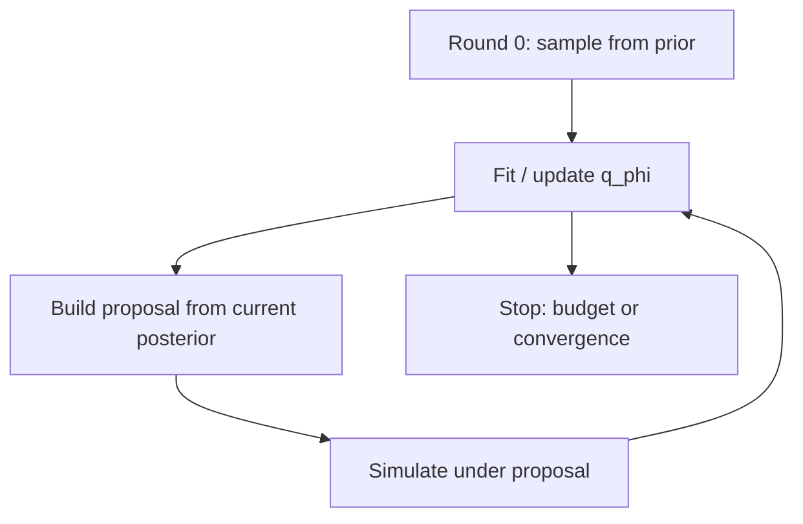

# RL for Neural Posterior Estimation

Simulation-based inference (SBI) approximates posteriors when the likelihood is intractable but a simulator can generate data. **Neural Posterior Estimation (NPE)** does that with a conditional generative model $q_{\phi}(\theta \mid x)$. **Reinforcement learning** enters when the scarce resource is not likelihood evaluations but *simulations*: which parameters to run next, how to adapt proposals across rounds, and how to push the generative estimator toward calibrated posteriors rather than a pure likelihood fit on prior-weighted data.

This note sits next to [RL for generative models](./rl-generative-models.md). That page is about RLHF-style fine-tuning of a generator (chat, images). Here the generator is the **posterior approximator**, and RL mostly acts on the **outer loop** — budget, proposals, active selection — not token-level preference.

**Prerequisites:** Bayes rule, basic importance sampling; familiarity with normalizing flows or another conditional density estimator helps. **Scope:** how RL-style ideas interface with NPE / SNPE pipelines. A full SBI survey, ABC, and neural likelihood estimation (NLE) are out of scope except as contrasts.

## Why likelihood-free inference shows up

Bayes’ rule is not the bottleneck. For observed data $x_{o}$ and parameters $\theta$,

$$
p(\theta \mid x_{o}) \propto p(x_{o} \mid \theta)\thinspace p(\theta)
$$

is fine when the likelihood $p(x_{o} \mid \theta)$ can be evaluated (or its gradient used in HMC). In a large class of scientific and engineering models it cannot. The map $\theta \mapsto x$ is defined by a **simulator** $g$: integrate ODEs/PDEs, run a SPICE transient, push particles through a transport code, ray-trace a detector. The simulator returns a sample $x \sim g(\theta)$ (possibly stochastic), not a density value $p(x \mid \theta)$.

That is the SBI setting: the likelihood is unavailable or too expensive to evaluate, but forward simulation is possible. The goal is still the posterior for one or many observations $x_{o}$.

Circuit and device work lives here constantly. Compact-model calibration, TCAD process corners, reliability aging models, and Monte Carlo over SPICE decks all produce $x$ from $\theta$ without a tractable $p(x \mid \theta)$. Molecular dynamics and mesoscopic transport codes are the same pattern: forward is natural, likelihood is not.

Classical workarounds — Approximate Bayesian Computation (ABC), synthetic likelihoods, hand-crafted summary statistics — struggle in moderate-to-high dimension and require careful tuning. Neural density estimation shifted the default: learn a flexible surrogate from simulated pairs $(\theta_{i}, x_{i})$ and amortize.

## Neural Posterior Estimation

**NPE** trains a conditional generative model

$$
q_{\phi}(\theta \mid x) \approx p(\theta \mid x)
$$

on pairs drawn by $\theta_{i} \sim p(\theta)$, $x_{i} \sim g(\theta_{i})$. The usual training objective is conditional maximum likelihood (or a flow / diffusion equivalent):

$$
\phi^\star = \arg\max_{\phi}\thinspace \mathbb{E}\_{\theta \sim p(\theta),\thinspace x \sim g(\theta)}\bigl[\log q_{\phi}(\theta \mid x)\bigr]
$$

Backbones are whatever conditional density estimators are current: coupling and autoregressive normalizing flows, continuous-time flow matching, diffusion / score models. Once trained, inference for a new $x_{o}$ is a forward sampling (or density) call — **amortized** inference. Pay the simulation cost once; reuse $q_{\phi}$ across many observations.

| Method | Learns | At inference |
|--------|--------|--------------|
| **NPE** | $q_{\phi}(\theta \mid x)$ | Sample / evaluate the posterior directly |
| **NLE** | $\hat{p}(x \mid \theta)$ | Run MCMC with the surrogate likelihood |
| **NRE** | Likelihood ratio $r(x,\theta)$ | MCMC or classification-based ratios |

NPE is attractive when many $x_{o}$ will appear (many dies, many devices, many events). NLE / NRE can be preferable when amortization is unnecessary and one wants standard MCMC diagnostics on a single observation. The RL discussion below focuses on NPE because the generative posterior model is explicit — but active simulation and proposal adaptation transfer to NLE/NRE with minor changes.

### What “amortized” buys — and what it costs

Amortization means $q_{\phi}(\cdot \mid x)$ must be accurate across a distribution of $x$, not only at one $x_{o}$. Training therefore spreads simulations over the prior predictive. That is also the failure mode: if the prior is broad and the posterior for a given $x_{o}$ is a thin ridge, most prior draws never visit the relevant $\theta$ region. The density estimator sees almost no training signal where it will later be queried. **Sequential** methods exist to fix that; RL is one way to systematize the fix.

## Sequential NPE and the proposal problem

Naive NPE samples $\theta$ from the prior. **Sequential NPE (SNPE)** runs in rounds. After round $r$, form a proposal $\tilde{p}\_{r}(\theta)$ from the current approximate posterior (truncation to high-density regions, mixture proposals, etc.), simulate under that proposal, and update $q_{\phi}$. Simulations concentrate where they matter for the observation(s) of interest.

There is a catch. If you train $q_{\phi}$ with ordinary conditional MLE on samples from $\tilde{p}_{r}$ instead of $p(\theta)$, you are no longer targeting $p(\theta \mid x)$ — you are targeting a posterior under the wrong prior. SNPE algorithms correct for that with importance weights, atomic proposals, or carefully chosen losses so that the fixed point remains the true posterior. The details differ across SNPE-A/B/C; the design tension is shared:

- **Propose** narrowly enough to waste fewer simulations.
- **Correct** carefully enough that $q_{\phi}$ does not converge to the wrong conditional.

SNPE already *feels* like closed-loop experimental design: the next batch of $\theta$ depends on what you have learned. Heuristics (sample from current $q_{\phi}(\theta \mid x_{o})$, truncate the prior) work surprisingly well. They also leave an obvious opening: replace the heuristic with a **learned policy** that maximizes a utility tied to posterior quality per simulation.

## Where the budget actually breaks

Before attaching RL, name the failure modes that motivate it.

**Expensive simulators.** Each $(\theta, x)$ pair may cost seconds to hours. A budget of $10^{3}$–$10^{5}$ simulations is not academic — it is the entire experiment. Methods that cut the required $N$ by a small factor are worth real engineering.

**Prior-weighted waste.** Under a diffuse prior, the fraction of draws that land near the posterior for a typical $x_{o}$ can be tiny. Conditional MLE then spends capacity modeling irrelevant regions of $\theta$-space. Sequential proposals help; poorly tuned proposals either stay too wide (waste) or collapse too early (miss modes, bad coverage).

**Mis-calibration.** $q_{\phi}$ can achieve low training NLL and still be overconfident: credible intervals that do not cover at the nominal rate. Simulation-based calibration (SBC), coverage tests, and classifier two-sample tests (C2ST) against a reference posterior catch this. Likelihood on the training pairs does not directly optimize those diagnostics.

**High-dimensional $\theta$.** Both proposal design and density estimation degrade. Local active selection (choose the next $\theta$ carefully) becomes more important than drawing large i.i.d. batches from a crude proposal.

RL does not replace the density estimator. It **allocates** simulations and sometimes **retargets** the training signal toward metrics that conditional MLE on the training set does not see.

## Casting the outer loop as an MDP

Treat proposal / active selection as a Markov decision process. One useful reading:

| MDP object | SBI reading |
|------------|-------------|
| State $s_{t}$ | Summary of current $q_{\phi}$: particles or moments, entropy under $x_{o}$, ensemble disagreement, round index, remaining budget |
| Action $a_{t}$ | Next $\theta$ to simulate, or parameters of a proposal density $q_{t}(\theta)$ |
| Transition | Run $x \sim g(\theta)$, append the pair, optionally take gradient steps on $\phi$ |
| Reward $R$ | Information gain, drop in validation loss, calibration / coverage improvement, C2ST or MMD to a reference posterior |

A policy $\pi(a \mid s)$ that maximizes expected cumulative reward is an **adaptive design** for the simulation budget. Formally this is the same object as RL for Bayesian experimental design or Bayesian optimization, with a generative posterior model inside the loop instead of a Gaussian process.

When the action is a continuous proposal parameter and the utility is differentiable, pathwise gradients may suffice and one never needs a full RL stack. RL becomes natural when:

- the utility is **non-differentiable** (coverage tests, C2ST, downstream task loss through a discrete decision);
- the horizon is **multi-step** (several rounds of simulate → update → propose) with delayed reward;
- the action is a **discrete choice** among candidate $\theta$ or among simulator fidelities.

Score-function (REINFORCE) estimators — the same identity used in [RL for generative models](./rl-generative-models.md) — already appear inside variational and adversarial SBI when a proposal or discriminator objective does not admit a pathwise gradient. The branding is not always “RL,” but the estimator is.

## Active and sequential simulation selection

This is the closest match to “real RL” in current SBI practice, and the right place to start.

**SNPE** already adapts the proposal over rounds. **Active Sequential NPE (ASNPE)** and related methods go further: instead of only sampling from the current posterior approximation, they **score candidate** $\theta$ values by a utility — typically where an additional simulation is expected to reduce uncertainty the most — and prefer high-utility candidates. That is classical Bayesian optimal design, with $q_{\phi}$ (or an ensemble of NPEs) supplying the uncertainty model.

An RL-shaped version makes the utility maximization **online and sequential**. The state encodes the current posterior approximation; the action selects the next $\theta$ (or a mini-batch); the reward is the realized improvement after the simulation and update. Useful reward proxies:

**Expected information gain.** In experimental design one often maximizes mutual information between parameters and the future observation. A common one-step utility is the expected reduction in posterior entropy (or a KL between prior-for-the-step and posterior-for-the-step). With an NPE ensemble, disagreement across members is a cheap uncertainty proxy when analytic entropy is awkward.

**Validation / held-out loss.** After adding a batch, measure $-\mathcal{L}$ on held-out simulated pairs near the region of interest. Noisy, but directly tied to density-estimation quality.

**Calibration and coverage.** SBC-style scores or empirical coverage of credible intervals. Slow to estimate and high variance — treat as an occasional reward or a filter, not necessarily the every-step signal.

**Distance to a reference posterior.** When a trustworthy reference is available on benchmark tasks (reject/accept ABC with huge budget, or an analytic posterior), C2ST accuracy or MMD between $q_{\phi}(\cdot \mid x_{o})$ and the reference is a sharp utility. On real problems the reference is missing; use this for method development, not deployment.

The policy can be a simple parametric proposal $q_{\psi}(\theta \mid s)$ trained with policy gradients, or a bandit / Bayesian optimization layer over a finite candidate set. For expensive simulators, even a myopic one-step lookahead (pick $\arg\max$ utility, no long-horizon credit assignment) already beats prior sampling; multi-step RL is justified when early simulations should explore and later ones exploit, with a budget horizon baked into the state.

## RL-style objectives on the generative posterior itself

A different lever: leave the proposal heuristic alone and change what $q_{\phi}$ is trained to optimize.

Conditional MLE on simulated pairs is the right fixed point for “match $p(\theta \mid x)$ under the training distribution.” It is the wrong objective when the deployed failure mode is **mis-calibration** or **bad downstream decisions**. One can fine-tune or regularize $q_{\phi}$ with rewards / penalties from:

- **Posterior predictive checks** — simulate $x' \sim g(\theta')$ for $\theta' \sim q_{\phi}(\theta \mid x_{o})$ and score whether $x'$ looks like $x_{o}$ under chosen summaries.
- **Simulation-based calibration** — ranks of true $\theta$ under the inferred posterior should be uniform; deviations become a loss.
- **Task loss** — if $\theta$ feeds a controller, optimizer, or yield decision, differentiate (or REINFORCE) through that loss.

This is closer in spirit to RLHF on generative models: the base model is trained by likelihood, then steered by a reward that likelihood does not encode. The analogy is imperfect — here there is often a ground-truth notion of calibration — but the machinery overlaps. Adversarial and variational SBI methods that use score-function gradients sit in the same neighborhood.

Flow-matching and diffusion-based posterior estimators also sit next to **diffusion / flow policies** in offline RL. Same generative toolkit; different reward. That does not by itself give a method, but it explains why ideas cross-pollinate quickly.

Use this lever when the proposal is already decent and the density still looks sharp and wrong. More prior-weighted simulations will not fix a calibration bug that the training loss does not see.

## Adaptive proposals and importance weights

Even without a full active-learning policy, the proposal $q(\theta)$ (or $q(\theta \mid x_{o})$) can be adapted so that importance-weighted NPE updates keep a healthy effective sample size. When ESS collapses, the sequential scheme is lying to itself: a few particles dominate, and the “posterior” is an artifact of weight degeneracy.

Adaptation rules range from simple (inflate proposal covariance, mixture with the prior) to learned (parametric $q_{\psi}$ updated from recent ESS / variance of weights). Bandit or RL updates are optional; what matters is closing the loop on a **diagnostic** (ESS, weight entropy) rather than only on training NLL.

A related thread is **domain randomization** and sim-to-real: treat simulator nuisance parameters as part of an outer adaptation loop so the amortized posterior transfers to real $x_{o}$. Neural posterior domain randomization is one named pattern; the RL connection is again the outer-loop policy over nuisances or fidelities.

## Hybrid pipelines: NPE inside RL, RL around the simulator

Two composition directions are easy to confuse and worth separating.

**NPE inside an RL agent.** The agent must act under parameter uncertainty (robust control, Bayes-adaptive MDPs). Each episode or time step, observations update a belief; $q_{\phi}(\theta \mid x)$ supplies that belief in amortized form. Here SBI is a **subroutine** for the belief state. The RL problem is the original control problem; NPE just replaces an extended Kalman filter or a particle filter when the observation model is a heavy simulator.

**RL around the simulator / SBI loop.** The MDP *is* the inference pipeline: actions choose $\theta$, fidelities, or hyperparameters; rewards are posterior quality. This is the outer-loop setting emphasized above.

For circuit and reliability modeling the first pattern is natural: infer device or process parameters from measurements, then make a decision (binning, guard-banding, stress conditions) under the posterior. The second pattern is natural when the simulator is so expensive that *designing the simulation campaign* is itself an optimization problem.

Multi-fidelity variants blur the line: an action may choose a cheap approximate simulator versus a gold-standard one, with a reward that trades information against cost. That is standard in BO; embedding it around NPE is still under-explored relative to how often real pipelines have cheap/approximate modes.

## Implementation sketch

A minimal outer-loop experiment looks like this.

The **environment** is the simulator $g$ plus the current NPE $q_{\phi}$. The **state** is a featurization of $q_{\phi}$ — moments or a particle set under $x_{o}$, predictive entropy, ensemble spread if you train several flows, and the remaining budget. The **action** is either a $\theta$ drawn from a parameterized proposal or a selection among candidates scored by a utility network. The **reward** should be chosen to match the scientific claim you want to make:

| Reward | Intent | Caveat |
|--------|--------|--------|
| Information gain / entropy drop | Prefer informative $\theta$ | Needs a decent uncertainty model |
| Validation loss | Improve density fit locally | Can overfit the validation construction |
| Calibration / SBC | Fight overconfidence | High variance; estimate infrequently |
| C2ST or MMD vs reference | Sharp on benchmarks | Reference missing on real problems |

**Stack.** Use **`sbi`** (or an equivalent) for NPE/SNPE baselines so the density-estimation half is not a moving target. Put the outer policy in a standard RL library (Stable-Baselines3, RLlib) or, for myopic design, in a BO package. If $g$ is differentiable, try pathwise gradients through proposal parameters before REINFORCE — variance matters when each reward costs a simulation.

**Benchmarking habit.** On toy tasks (Gaussian linear, SLCP, two moons) one can afford a reference posterior and plot posterior quality against simulation count for: prior NPE, SNPE, ASNPE-style active selection, and any RL policy. Claim wins only on the budget–quality curve, not on a single-$N$ snapshot. Then move to a simulator you already trust in your domain (even a reduced SPICE or analytic surrogate) before touching production TCAD.

## What is mature vs what is open

Active and sequential simulation for NPE is the mature-ish core: SNPE variants, ASNPE, round-free and pruning schemes that discard uninformative simulations. REINFORCE-style gradients appear inside variational and adversarial SBI as a technique, often without the RL label. End-to-end RL policies over NPE budgets — learned $\pi(a \mid s)$ with long-horizon credit assignment — are emerging in adjacent communities (physics, cosmology, policy learning with SBI beliefs) but are not a single standard recipe.

**If it works, the payoff is concrete:** fewer simulations for comparable posterior quality; better concentration on relevant $\theta$; room to optimize calibration and task loss, not only training NLL.

**The hard parts are also concrete.** Rewards that depend on posterior quality are noisy and often delayed across many simulator calls. The MDP is non-stationary because $q_{\phi}$ moves as data arrive. Density-estimation pathologies (mode collapse, overconfidence) interact with the outer loop: a collapsed $q_{\phi}$ produces overconfident states and a policy that stops exploring. Same Goodhart risk as other RL-for-design systems — optimize the proxy hard enough and the real posterior diagnostics get worse.

## Mental model

The simulator is the oracle; the likelihood is unavailable. NPE amortizes $p(\theta \mid x)$ with a conditional generator trained on simulated pairs. SNPE and active learning already close the loop on *where* to simulate next; RL is the general language for that loop when the utility is sequential, non-differentiable, or multi-objective. Keep the density estimator honest with calibration checks, and do not let the outer reward redefine “good posterior” into “good at gaming the proxy.”

Relative to [RL for generative models](./rl-generative-models.md): there the policy *is* the generator and the reward is preference or task success; here the policy usually *feeds* the generator with better training data (or a better training objective), and the reward is inference quality per simulation.

## Related notes

- [Reinforcement Learning for Generative Models](./rl-generative-models.md) — policy gradients, KL trust regions, and rewards that are not likelihood (LLM / alignment setting).
- [Modified Nodal Analysis](../spice/modified-nodal-analysis.md) — the kind of simulator stack where likelihood-free inference shows up in practice.

**Pointers:** Cranmer, Brehmer & Louppe on the SBI landscape; Papamakarios et al. on neural density estimation and NPE; Greenberg, Nonnenmacher & Macke on automatic posterior transformation (SNPE); the `sbi` package documentation; ASNPE and related active-simulation papers. Direct “RL + NPE” as a named standard method is still thin — treat this as a design pattern sitting on top of SNPE/active learning, not as a drop-in algorithm.
