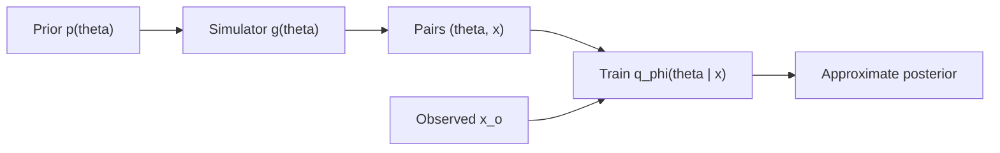
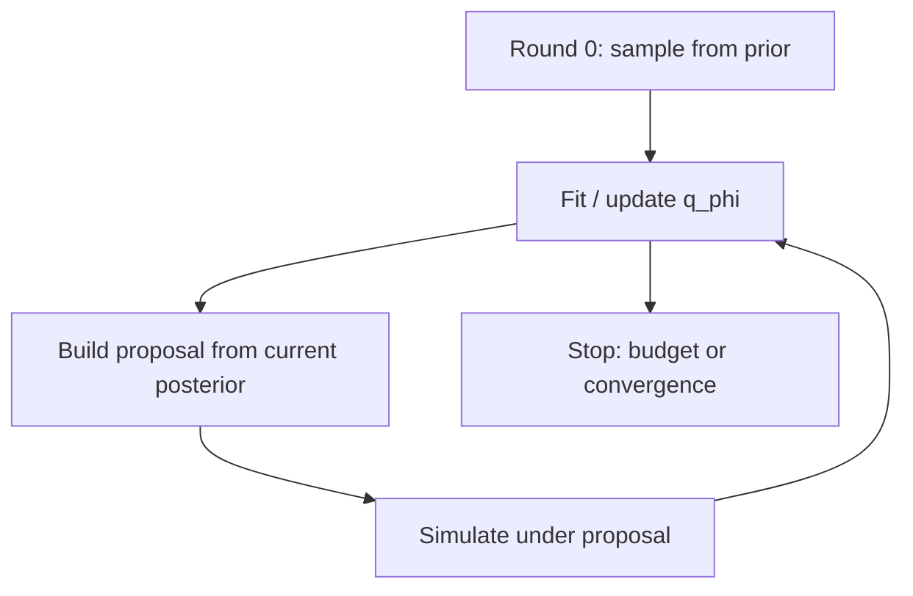

# RL for Neural Posterior Estimation

Simulation-based inference (SBI) approximates posteriors when the likelihood is intractable but a simulator can generate data. **Neural Posterior Estimation (NPE)** does that with a conditional generative model. **Reinforcement learning** enters when the scarce resource is not likelihood evaluations but *simulations*: which parameters to run, how to adapt proposals, and how to steer the generative estimator toward calibrated posteriors rather than pure likelihood fit on prior-weighted data.

This note is adjacent to [RL for generative models](./rl-generative-models.md) (RLHF / policy gradients on generators). Here the generator is the *posterior approximator* $q_{\phi}(\theta \mid x)$, and RL mostly acts on the **outer loop** — budget, proposals, active selection — not chat preference.

**Prerequisites:** Bayes rule, basic importance sampling; familiarity with normalizing flows or another conditional density estimator helps. **Scope:** how RL-style ideas interface with NPE/SNPE pipelines. Full SBI survey, ABC algorithms, and neural likelihood estimation (NLE) details are out of scope except as contrasts.

## SBI in one picture

When $p(x \mid \theta)$ cannot be evaluated (or is too expensive), but a simulator $x \sim g(\theta)$ is available, classical MCMC/HMC on the likelihood is blocked. SBI targets the posterior for observed data $x_{o}$:

$$
p(\theta \mid x_{o}) \propto p(x_{o} \mid \theta)\thinspace p(\theta)
$$

without evaluating $p(x_{o} \mid \theta)$. Draw $\theta_{i} \sim p(\theta)$, simulate $x_{i} = g(\theta_{i})$, and learn a surrogate of the posterior (or likelihood, or likelihood ratio) from the pairs $(\theta_{i}, x_{i})$.

For physics and circuit work this is familiar: compact models, TCAD, SPICE Monte Carlo, molecular dynamics — likelihoods are rarely closed form; simulators are.

## Neural Posterior Estimation

**NPE** trains a conditional generative model

$$
q_{\phi}(\theta \mid x) \approx p(\theta \mid x)
$$

on simulated pairs. Typical backbones: normalizing flows, flow matching, diffusion / score models. Once trained, inference for a new $x_{o}$ is a forward pass (amortized).

| Method | Learns | At inference |
|--------|--------|--------------|
| **NPE** | $q_{\phi}(\theta \mid x)$ | Sample / density of posterior directly |
| **NLE** | $\hat{p}(x \mid \theta)$ | MCMC with surrogate likelihood |
| **NRE** | Likelihood ratio | MCMC or classification-based ratios |

**Why amortization matters:** many downstream $x_{o}$ (e.g. many chips, many devices) reuse one trained $q_{\phi}$. The training cost is paid in simulations up front.

### Sequential NPE (SNPE)

Naive NPE samples $\theta$ from the prior. Most draws land far from the posterior mass relevant to a given $x_{o}$ — wasted budget. **SNPE** runs rounds: after round $r$, use the current posterior (or a truncated proposal) as the proposal for round $r{+}1$, concentrating simulations where they matter for that observation (or a batch of them).

SNPE already *feels* like closed-loop experimental design. RL makes the loop explicit as a policy over what to simulate next.

## Where the budget breaks

| Pain point | What goes wrong |
|------------|-----------------|
| **Expensive $g(\theta)$** | Each $(\theta, x)$ pair costs minutes to hours (TCAD, CFD, cosmology) |
| **Prior-weighted waste** | Mass of $p(\theta)$ misses the posterior ridge for $x_{o}$ |
| **Mis-calibration** | $q_{\phi}$ fits training pairs but coverage / calibration fails on held-out $x$ |
| **High-$d$ $\theta$** | Proposal design and density estimation both degrade |

RL does not replace the density estimator; it **allocates** simulations and sometimes **retargets** the training objective toward metrics likelihood on the training set does not see.

## RL view of the SBI outer loop

Treat proposal / active selection as an MDP:

| MDP object | SBI reading |
|------------|-------------|
| State $s_{t}$ | Features of current $q_{\phi}$: samples, mean/cov, ensemble disagreement, round index, remaining budget |
| Action $a_{t}$ | Next $\theta$ to simulate, or parameters of a proposal $q_{t}(\theta)$ |
| Transition | Run simulator, append $(\theta, x)$, (optionally) update $q_{\phi}$ |
| Reward $R$ | Information gain, drop in validation loss, calibration / coverage, C2ST or MMD to a reference posterior |

A policy $\pi(a \mid s)$ that maximizes expected cumulative reward is an **adaptive design** for the simulation budget. This is the same formal object as RL for experimental design / Bayesian optimization, with a generative posterior model in the loop.

Policy-gradient estimators (REINFORCE-style) already show up inside variational and adversarial SBI methods when a proposal or discriminator objective is non-differentiable through discrete choices — see the score-function discussion in [RL for generative models](./rl-generative-models.md).

## Ways RL helps NPE / SBI

### 1. Active / sequential simulation selection

Closest to “real” RL in current practice.

- **SNPE** refines proposals over rounds (truncation, mixture proposals, etc.).
- **Active Sequential NPE (ASNPE)** and relatives score candidate $\theta$ by *utility* — where simulating reduces uncertainty most — rather than only sampling from the current posterior.
- **RL extension:** learn $\pi(a \mid s)$ so the utility is optimized online. Reward proxies:
  - expected information gain / mutual information with $\theta$
  - decrease in $\mathrm{KL}$ to a validation or ensemble posterior
  - improvement in coverage or calibration diagnostics

State can come from an ensemble of NPEs (disagreement = uncertainty) or from the flow’s own entropy / predictive variance under $x_{o}$.

### 2. RL-style objectives on the generative posterior model

Less common, more speculative — but aligned with the generative-RL theme:

- Fine-tune $q_{\phi}$ with rewards from **posterior predictive checks**, **simulation-based calibration**, or a **downstream decision loss** (inferred $\theta$ feeds a controller / optimizer).
- Adversarial and variational SBI objectives sometimes use score-function gradients that are policy-gradient cousins.
- Flow-matching and diffusion posterior estimators sit next to **diffusion / flow policies** in offline RL — same generative toolkit, different reward.

Useful when the failure mode is not “wrong proposal” but “density looks sharp and is wrong.” Likelihood on simulated pairs will not fix that by itself.

### 3. Adaptive proposals and importance weights

Learn a proposal $q(\theta)$ (or $q(\theta \mid x_{o})$) that covers posterior support better than the prior for importance-weighted NPE updates. RL / bandit updates can adapt $q$ when the effective sample size collapses. Related thread: **domain randomization** and sim-to-real (e.g. neural posterior domain randomization) — proposals or simulator nuisance parameters adapted so the amortized posterior transfers.

### 4. Hybrid pipelines

Two directions of composition:

- **NPE inside RL:** agent acts under posterior uncertainty (robust / Bayes-adaptive control); $q_{\phi}(\theta \mid x)$ supplies beliefs.
- **RL around the simulator:** meta-loop over simulator hyperparameters, fidelities, or multi-fidelity budgets, with NPE quality as reward.

For circuit/reliability modeling the first pattern is natural: infer device or process parameters, then decide under that posterior.

## Implementation sketch

**Environment:** simulator $g$ + current NPE $q_{\phi}$.  
**State:** summary of $q_{\phi}$ (moments, particles, ensemble spread) and budget left.  
**Action:** sample $\theta$ from a parameterized proposal, or pick among candidates.  
**Reward (examples):**

| Reward | Intent |
|--------|--------|
| Information gain | Prefer $\theta$ that shrink posterior uncertainty under $x_{o}$ |
| Validation loss | $R = -\mathcal{L}(q_{\phi})$ on held-out simulated pairs |
| Calibration | Coverage / SBC-style scores so $q_{\phi}$ is not overconfident |

C2ST or MMD against a reference posterior (when available) are also usable utilities.
Practical stack: **`sbi`** (NPE/SNPE baselines in Python) plus an RL library (Stable-Baselines3, RLlib) for the outer policy. If $g$ is differentiable, pathwise gradients can replace or complement score-function estimators for proposal parameters — lower variance when available.

**Benchmark habit:** start from standard SBI tasks (Gaussian linear, SLCP, two moons, and domain simulators you already trust) and compare simulation budgets to SNPE / ASNPE before claiming RL wins.

## What exists vs what is open

| Thread | Status |
|--------|--------|
| Active / sequential simulation for NPE | Mature-ish (SNPE, ASNPE, round-free / pruning variants) |
| REINFORCE-like grads in variational / adversarial SBI | Present as technique, not always branded “RL” |
| End-to-end RL policy over NPE budgets | Emerging / adjacent (physics, cosmology, policy+SBI hybrids); no single standard |

**Payoff if it works:** fewer simulations for comparable posterior quality; better concentration on relevant $\theta$; room to optimize calibration and task loss, not only training NLL.

**Hard parts:** high-variance rewards; credit assignment across long simulation horizons; instability when the reward depends on a moving $q_{\phi}$ (non-stationary MDP). Same failure modes as other RL-for-design loops — plus density-estimation pathologies (mode collapse, overconfidence).

## Mental model

1. **Simulator is the oracle**; likelihood is unavailable.
2. **NPE** amortizes $p(\theta \mid x)$ with a conditional generator.
3. **SNPE / active learning** already close the loop on *where* to simulate.
4. **RL** is the general language for that loop when the utility is sequential and not a fixed heuristic.
5. Keep the density estimator honest with calibration checks; do not let the outer reward Goodhart the posterior.

## Related notes

- [Reinforcement Learning for Generative Models](./rl-generative-models.md) — policy gradients, KL trust regions, and rewards that are not likelihood (same toolkit, LLM/alignment setting).
- [Modified Nodal Analysis](../spice/modified-nodal-analysis.md) — the kind of simulator stack where likelihood-free inference shows up in practice.

**Pointers:** Cranmer, Brehmer & Louppe on SBI; Papamakarios et al. on neural density estimation / NPE; the `sbi` package documentation; ASNPE and sequential NPE papers for active simulation. Direct “RL+NPE” as a named standard is still thin — treat this as a design pattern, not a recipe.
