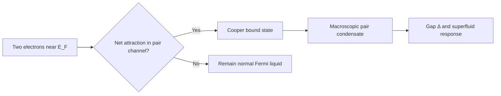

# BCS Superconductivity Theory

The **Bardeen–Cooper–Schrieffer (BCS)** theory explains conventional (low-$T_c$) superconductivity as a **Cooper-pair condensate** of electrons near the Fermi surface, stabilized by an effective **attractive** interaction mediated by phonons. It is mean-field many-body physics: one variational ground state captures the essential gap, thermodynamics, and electrodynamics.

**Prerequisites:** Fermi liquid / free-electron gas, second quantization, basic statistical mechanics at $T=0$ and finite $T$. **Scope:** BCS weak-coupling mean field and its measurable consequences. Eliashberg strong-coupling numerics, unconventional pairing symmetries, and high-$T_c$ cuprates are out of scope here.

## Phenomenology BCS must explain

| Observation | Normal metal | Superconductor (BCS) |
|-------------|--------------|----------------------|
| DC resistivity | Finite | **Zero** below $T_c$ |
| Specific heat | $C \propto T$ (electronic) | $C \propto \exp(-\Delta/k_B T)$ at low $T$; **discontinuous** at $T_c$ |
| Magnetic field | Penetrates | **Meissner effect** — field expelled (Type I/II details aside) |
| Isotope effect | — | $T_c \propto M^{-\alpha}$ with $\alpha \approx 0.5$ → **phonon-mediated** pairing |

The order parameter is a **complex gap** $\Delta(\mathbf{r})$ (or $\Delta_{\mathbf{k}}$ in momentum space): the amplitude of Cooper-pair coherence. In s-wave BCS, $\Delta$ is uniform in $\mathbf{k}$ on the Fermi surface.

## Cooper instability

Two electrons above a filled Fermi sea with **opposite momenta** and **opposite spins** ($\mathbf{k}\uparrow$, $-\mathbf{k}\downarrow$) can form a bound state if the interaction is **net attractive** in that channel — even when the bare Coulomb repulsion is large, phonon exchange can win at energies $\hbar\omega_D \ll E_F$ (Debye scale $\ll$ Fermi energy).

Cooper’s variational argument (1956): with an attractive square-well potential of width $2\hbar\omega_D$ around $E_F$, a bound pair exists for **arbitrarily weak** attraction in 3D. That instability at $T=0$ is the seed of BCS.

## BCS Hamiltonian (reduced form)

In momentum space, restricting to the pairing channel:

$$
\mathcal{H} = \sum_{\mathbf{k},\sigma} \xi_{\mathbf{k}}\, c_{\mathbf{k}\sigma}^\dagger c_{\mathbf{k}\sigma}
+ \sum_{\mathbf{k}} \left( \Delta\, c_{\mathbf{k}\uparrow}^\dagger c_{-\mathbf{k}\downarrow}^\dagger + \Delta^* c_{-\mathbf{k}\downarrow} c_{\mathbf{k}\uparrow} \right)
+ \frac{|\Delta|^2}{g}
$$

- $\xi_{\mathbf{k}} = \epsilon_{\mathbf{k}} - \mu$ is measured from the chemical potential (vanishes on the Fermi surface).
- $\Delta$ is the **pair potential** (order parameter), determined self-consistently.
- $g > 0$ is the effective pairing coupling (phonon-mediated attraction in the reduced model).

The quartic interaction that generates $\Delta$ is often written schematically as

$$
\mathcal{H}_{\text{int}} = -\frac{g}{V} \sum_{\mathbf{k}} c_{\mathbf{k}\uparrow}^\dagger c_{-\mathbf{k}\downarrow}^\dagger c_{-\mathbf{k}\downarrow} c_{\mathbf{k}\uparrow}
$$

with $g$ nonzero only for $|\xi_{\mathbf{k}}| < \hbar\omega_D$ (Debye cutoff). Mean-field decoupling replaces the four-operator term by $\Delta c^\dagger c^\dagger + \text{h.c.}$ plus $|\Delta|^2/g$.

## Bogoliubov quasiparticles

Diagonalize $\mathcal{H}$ via the **Bogoliubov transformation**:

$$
\gamma_{\mathbf{k}\uparrow} = u_{\mathbf{k}} c_{\mathbf{k}\uparrow} - v_{\mathbf{k}} c_{-\mathbf{k}\downarrow}^\dagger, \quad
\gamma_{-\mathbf{k}\downarrow}^\dagger = u_{\mathbf{k}} c_{-\mathbf{k}\downarrow}^\dagger + v_{\mathbf{k}} c_{\mathbf{k}\uparrow}
$$

with $u_{\mathbf{k}}^2 + v_{\mathbf{k}}^2 = 1$ and $u_{\mathbf{k}} v_{\mathbf{k}} = \Delta / 2E_{\mathbf{k}}$. The Hamiltonian becomes

$$
\mathcal{H} = \sum_{\mathbf{k}} E_{\mathbf{k}} \left( \gamma_{\mathbf{k}\uparrow}^\dagger \gamma_{\mathbf{k}\uparrow} + \gamma_{-\mathbf{k}\downarrow}^\dagger \gamma_{-\mathbf{k}\downarrow} \right) + E_0
$$

**Bogoliubov dispersion:**

$$
E_{\mathbf{k}} = \sqrt{\xi_{\mathbf{k}}^2 + |\Delta|^2}
$$

- $E_{\mathbf{k}} \geq |\Delta|$: the **superconducting gap** is the minimum excitation energy.
- Creating a real electron at $\mathbf{k}$ costs at least $\Delta$ if $\xi_{\mathbf{k}} = 0$ — scattering that would degrade coherence is **suppressed** at low $T$, hence zero DC resistance.

For a **s-wave** order parameter, $|\Delta_{\mathbf{k}}| = \Delta$ is constant on the Fermi surface; angle-dependent gaps appear in anisotropic or unconventional superconductors.

## Gap equation (self-consistency)

At $T = 0$, the self-consistency condition for $\Delta$ is

$$
1 = g \sum_{\mathbf{k}} \frac{1}{2E_{\mathbf{k}}}
\quad \Rightarrow \quad
1 = N(0)\, g \int_0^{\hbar\omega_D} \frac{d\xi}{\sqrt{\xi^2 + \Delta^0}}
$$

with $N(0)$ the normal-state density of states at the Fermi level. Evaluating the integral gives the **BCS gap equation**:

$$
\Delta^0 = 2\hbar\omega_D \exp\!\left(-\frac{1}{N(0)\, g}\right)
$$

At finite $T$, thermal quasiparticle occupancy smears the gap:

$$
1 = N(0)\, g \int_0^{\hbar\omega_D} d\xi\; \frac{\tanh(E/2k_B T)}{\sqrt{\xi^2 + \Delta^2(T)}}
$$

The gap vanishes at **$T_c$** where the linearized equation yields

$$
k_B T_c = \frac{2 e^\gamma}{\pi}\, \hbar\omega_D \exp\!\left(-\frac{1}{N(0)\, g}\right), \quad \gamma \approx 0.5772\ \text{(Euler–Mascheroni)}
$$

**Weak-coupling BCS ratios** (useful sanity checks):

$$
\frac{\Delta^0}{k_B T_c} \approx 1.764, \qquad
\frac{C_s - C_n}{C_n}\bigg|_{T_c} \approx 1.43
$$

The **isotope effect** $T_c \propto M^{-1/2}$ follows because $\hbar\omega_D \propto M^{-1/2}$ when phonons mediate pairing.

## Ginzburg–Landau and electrodynamics

Near $T_c$, a **Ginzburg–Landau (GL)** expansion in $|\psi|^2$ captures the same order parameter with a coherence length $\xi \sim v_F / \Delta$ and penetration depth $\lambda_L$. BCS microscopically fixes the GL coefficients.

**London equation** (local limit, $T \ll T_c$):

$$
\nabla \times \mathbf{j}_s = -\frac{n_s e^2}{m}\, \mathbf{B}
$$

Persistent supercurrents screen magnetic fields over $\lambda_L$ — the **Meissner effect**. A superconductor in an applied field is not merely a zero-resistance conductor; it is a **perfect diamagnet** (up to flux quantization and vortex physics in Type II materials).

**Flux quantization:** magnetic flux through a superconducting loop is quantized in units of $\Phi_0 = h/2e$, reflecting the **$2e$ charge** of Cooper pairs.

## Josephson effect (device-relevant)

Two superconductors separated by a thin insulator form a **Josephson junction**. The **DC Josephson relation**:

$$
I = I_c \sin(\phi)
$$

where $\phi$ is the difference of the superconducting phases across the barrier and $I_c$ depends on $\Delta$ and tunneling. The **AC Josephson relation** $\dot\phi = 2eV/\hbar$ links phase evolution to voltage — the basis of **SQUIDs**, voltage standards, and superconducting qubits.

For someone coming from **nanostructures and transport**, the same pairing physics appears when a normal metal or semiconductor is proximitized by a superconductor: induced gaps, Andreev reflection, and subgap conductance are mesoscopic signatures of the BCS order parameter.

## Density of states

The quasiparticle **DOS** (per spin) is

$$
N_s(E) = N(0)\, \frac{|E|}{\sqrt{E^2 - \Delta^2}}, \qquad |E| > \Delta
$$

with a **square-root van Hove singularity** at $|E| = \Delta$. Tunneling spectroscopy (STM on superconductors, or planar junction $dI/dV$) measures this directly — a clean experimental handle on $\Delta$ and, with strong coupling, phonon structure (Eliashberg regime).

## Limitations and extensions

| Regime | BCS mean field | What changes |
|--------|----------------|--------------|
| Weak coupling ($N(0)g \ll 1$) | Quantitative | — |
| Strong coupling (Pb, Hg) | Qualitative trends OK | **Eliashberg** theory: retardation, $\Delta / k_B T_c > 1.764$ |
| High-$T_c$ cuprates | Wrong mechanism | Antiferromagnetic fluctuations, d-wave pairing, pseudogap |
| Ultrasmall grains / 1D | Fluctuations matter | Parity effect, level spacing vs $\Delta$ |
| Unconventional symmetry | s-wave assumption fails | Gap nodes, anisotropic pairing |

BCS is the **reference frame** for conventional superconductivity: Cooper pairing, broken U(1) symmetry, gapped quasiparticles, and macroscopic phase coherence. Modern **circuit QED** and **superconducting qubits** still live in this picture, with junction nonlinearity and charge noise layered on top.

## Related notes

- Quantum transport and mesoscopic signatures: pair tunneling, Andreev reflection (not yet a dedicated page here).
- [Minkowski Space](./minkowski-space.md) — unrelated physically, but the same “state a convention, then compute” style applies.

**References (standard):** Bardeen, Cooper & Schrieffer, *Phys. Rev.* **108**, 1175 (1957); de Gennes, *Superconductivity of Metals and Alloys*; Tinkham, *Introduction to Superconductivity*.
