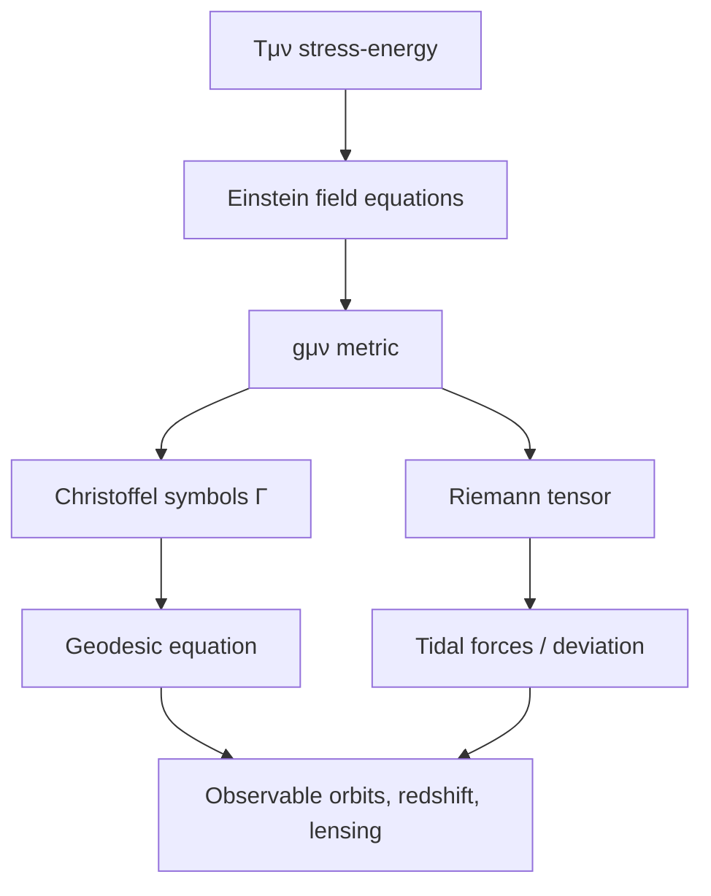

# Curved Spacetime

General relativity replaces the fixed Minkowski metric $\eta_{\mu\nu}$ with a position-dependent **Lorentzian metric** $g_{\mu\nu}(x)$ on a differentiable manifold. Gravity is not a force in the Newtonian sense — it is the geometry of spacetime, encoded in $g_{\mu\nu}$ and its derivatives.

## From flat to curved

In special relativity, free particles follow straight worldlines in Minkowski space. In GR, free particles follow **geodesics** of $(\mathcal{M}, g)$:

$$
\frac{d^2 x^\mu}{d\tau^2} + \Gamma^\mu_{\alpha\beta} \frac{dx^\alpha}{d\tau}\frac{dx^\beta}{d\tau} = 0
$$

The **Christoffel symbols** (connection coefficients) are

$$
\Gamma^\mu_{\alpha\beta} = \frac{1}{2} g^{\mu\nu}\left(\partial_\alpha g_{\nu\beta} + \partial_\beta g_{\nu\alpha} - \partial_\nu g_{\alpha\beta}\right)
$$

In flat spacetime with inertial coordinates, $g_{\mu\nu} = \eta_{\mu\nu}$ and $\Gamma^\mu_{\alpha\beta} = 0$ — geodesics reduce to straight lines.

## The Einstein field equations

Matter and energy curve spacetime via

$$
G_{\mu\nu} + \Lambda g_{\mu\nu} = 8\pi G\thinspace  T_{\mu\nu}
$$

where

$$
G_{\mu\nu} = R_{\mu\nu} - \frac{1}{2} R\thinspace  g_{\mu\nu}
$$

is the **Einstein tensor**, $R_{\mu\nu}$ the Ricci tensor, $R$ the Ricci scalar, $\Lambda$ the cosmological constant, and $T_{\mu\nu}$ the stress-energy tensor.

In vacuum ($T_{\mu\nu} = 0$), the field equations become $R_{\mu\nu} = 0$ (when $\Lambda = 0$) — spacetime can still be curved (Schwarzschild solution).

## Riemann curvature

The **Riemann tensor** measures intrinsic curvature:

$$
R^\rho_{\ \sigma\mu\nu} = \partial_\mu \Gamma^\rho_{\nu\sigma} - \partial_\nu \Gamma^\rho_{\mu\sigma} + \Gamma^\rho_{\mu\lambda}\Gamma^\lambda_{\nu\sigma} - \Gamma^\rho_{\nu\lambda}\Gamma^\lambda_{\mu\sigma}
$$

Key symmetries: $R_{\rho\sigma\mu\nu} = -R_{\sigma\rho\mu\nu}$, $R_{\rho\sigma\mu\nu} = R_{\mu\nu\rho\sigma}$, and the Bianchi identity $R_{\rho[\sigma\mu\nu]} = 0$.

Flat spacetime has $R^\rho_{\ \sigma\mu\nu} = 0$ globally; locally, any smooth Lorentzian manifold is approximately Minkowski in a small enough neighborhood (equivalence principle).

## Relation to Minkowski space

| Concept | Minkowski (SR) | Curved (GR) |
|---------|----------------|-------------|
| Metric | Constant $\eta_{\mu\nu}$ | Field $g_{\mu\nu}(x)$ |
| Free motion | Straight lines | Geodesics |
| Connection | $\Gamma = 0$ (inertial coords) | Generally non-zero |
| Curvature | $R = 0$ everywhere | $R \neq 0$ in general |
| Tangent space | Global | Locally Minkowski at each point |

Every Lorentzian manifold has, at each event $p$, a tangent space $T_p\mathcal{M}$ equipped with Minkowski inner product $g_{\mu\nu}(p)$. Special relativity governs physics in that infinitesimal neighborhood; global curvature accumulates over finite distances.

## Schwarzschild metric (spherical symmetry)

Outside a spherically symmetric mass $M$ (in geometric units $G = c = 1$):

$$
ds^2 = -\left(1 - \frac{2M}{r}\right) dt^2 + \left(1 - \frac{2M}{r}\right)^{-1} dr^2 + r^2 d\Omega^2
$$

where $d\Omega^2 = d\theta^2 + \sin^2\theta\thinspace d\phi^2$.

- **Event horizon** at $r = 2M$
- **Gravitational redshift** — clocks run slower in stronger gravitational fields
- **Perihelion precession** — Mercury's orbit precesses because $R \neq 0$

## Geodesic deviation (tidal forces)

Nearby geodesics do not remain parallel in curved spacetime. The separation vector $V^\mu$ between two geodesics satisfies

$$
\frac{D^2 V^\mu}{d\tau^2} = -R^\mu_{\ \nu\rho\sigma} u^\nu V^\rho u^\sigma
$$

This is the relativistic origin of **tidal gravity** — the Riemann tensor directly measures how a gravitational field differs from place to place.

## Curvature and physics pipeline

## Weak-field limit

For weak, static fields ($|\Phi| \ll 1$, slow motion), write

$$
g_{00} \approx -(1 + 2\Phi), \quad g_{ij} \approx (1 - 2\Phi)\delta_{ij}
$$

where $\Phi$ is the Newtonian gravitational potential. The geodesic equation reproduces $\ddot{\mathbf{x}} = -\nabla\Phi$ — Newtonian gravity emerges as a limit.

## Why curved spaces appear in physics

1. **Equivalence principle** — gravity is locally indistinguishable from acceleration; globally it requires curved geometry.
2. **Coordinate independence** — tensor equations on manifolds express laws valid in any smooth coordinate chart.
3. **Cosmology** — the universe's large-scale structure is modeled as a time-dependent curved (often Friedmann–Lemaître–Robertson–Walker) spacetime.
4. **Black holes & waves** — regions where $g_{\mu\nu}$ deviates radically from $\eta_{\mu\nu}$ are observational targets (LIGO, EHT).

Minkowski space is the linearized, zero-curvature backbone; curved Lorentzian geometry is the dynamical stage on which matter writes its gravitational history.
