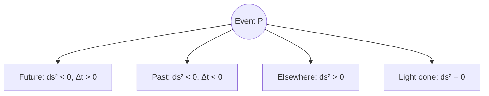

# Minkowski Space

Minkowski space is the flat four-dimensional spacetime manifold of special relativity. It replaces the Galilean separation of absolute time and Euclidean space with a single geometric structure where temporal and spatial separations enter on equal footing — but with opposite sign.

## The metric

In coordinates $(t, x, y, z)$ with $c = 1$, the **Minkowski metric** is

$$
\eta_{\mu\nu} = \text{diag}(-1, +1, +1, +1)
$$

The **line element** (invariant interval) between two events is

$$
ds^2 = \eta_{\mu\nu}\, dx^\mu dx^\nu = -dt^2 + dx^2 + dy^2 + dz^2
$$

Einstein summation convention applies. The signature $(-+++)$ is common in particle physics; $(+---)$ appears in some GR texts — physics is unchanged up to an overall sign convention.

## Event classification

For a displacement $\Delta x^\mu$ from one event to another:

| Condition | Name | Physical meaning |
|-----------|------|------------------|
| $ds^2 < 0$ | **Timelike** | Events connectable by a massive particle worldline |
| $ds^2 = 0$ | **Null / lightlike** | Events connectable only at speed of light |
| $ds^2 > 0$ | **Spacelike** | No causal signal can travel between them |

The light cone at an event $P$ divides spacetime into future, past, and elsewhere:

## Lorentz transformations

Transformations preserving $\eta_{\mu\nu}$ form the **Lorentz group** $O(1,3)$. A boost with velocity $v$ along $x$:

$$
\Lambda^\mu_{\ \nu} =
\begin{pmatrix}
\gamma & -\beta\gamma & 0 & 0 \\
-\beta\gamma & \gamma & 0 & 0 \\
0 & 0 & 1 & 0 \\
0 & 0 & 0 & 1
\end{pmatrix},
\quad
\beta = \frac{v}{c},\ \gamma = \frac{1}{\sqrt{1-\beta^2}}
$$

Proper Lorentz transformations ($\det\Lambda = +1$) include continuous boosts and rotations; discrete parity and time reversal are in $O(1,3)$ but not the connected component.

## Four-vectors

Quantities transforming as $V'^\mu = \Lambda^\mu_{\ \nu} V^\nu$ include:

**Four-position:** $x^\mu = (t, \mathbf{x})$

**Four-velocity:** $u^\mu = \frac{dx^\mu}{d\tau}$ where $\tau$ is proper time. Normalization: $u^\mu u_\mu = -1$.

**Four-momentum:** $p^\mu = m u^\mu = (E, \mathbf{p})$ with

$$
p^\mu p_\mu = -m^2
\quad \Leftrightarrow \quad
E^2 = |\mathbf{p}|^2 + m^2
$$

**Four-gradient:** $\partial_\mu = \frac{\partial}{\partial x^\mu}$

Raising and lowering indices uses $\eta_{\mu\nu}$: $v_\mu = \eta_{\mu\nu} v^\nu$.

## Relativistic mechanics in geometric form

Newton's second law becomes the geodesic equation in flat spacetime (trivial Christoffel symbols):

$$
\frac{d u^\mu}{d\tau} = \frac{q}{m} F^{\mu\nu} u_\nu
$$

where $F^{\mu\nu}$ is the electromagnetic field tensor. Energy-momentum conservation for a closed system:

$$
\partial_\mu T^{\mu\nu} = 0
$$

The **stress-energy tensor** $T^{\mu\nu}$ encodes energy density, momentum density, and stress in a single symmetric (for perfect fluids and EM) rank-2 tensor.

## Maxwell equations

In natural units ($\varepsilon_0 = \mu_0 = c = 1$), Maxwell's equations unify as

$$
\partial_\mu F^{\mu\nu} = J^\nu, \quad
\partial_{[\lambda} F_{\mu\nu]} = 0
$$

where $F_{\mu\nu} = \partial_\mu A_\nu - \partial_\nu A_\mu$ is the field strength and $J^\mu = (\rho, \mathbf{j})$ is the four-current. The second equation is the Bianchi identity (homogeneous Maxwell equations).

## Why Minkowski space matters

1. **Covariance** — physical laws take the same form in all inertial frames without ad hoc length contraction or time dilation factors.
2. **Causality** — the metric defines light cones and forbids superluminal influence.
3. **Bridge to GR** — Minkowski space is the tangent space at any point of a curved Lorentzian manifold; special relativity is local flatness.

The transition from Minkowski space to curved spacetime is developed in [Curved Spacetime](./curved-spacetime.md).
