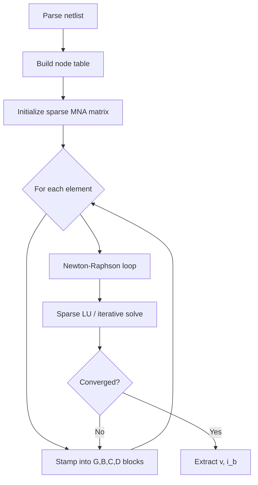

# Modified Nodal Analysis

Modified Nodal Analysis (MNA) is the formulation used by SPICE-family simulators to assemble and solve large, sparse circuit equations. It extends classical nodal analysis by augmenting the unknown vector with branch currents for elements that cannot be expressed solely in terms of node voltages.

## Classical nodal analysis

For a circuit with $N$ nodes (excluding the reference ground), nodal analysis writes Kirchhoff's Current Law (KCL) at each non-reference node:

$$
\sum_k i_k = 0
$$

For resistors, the current from node $i$ to node $j$ is $G_{ij}(v_i - v_j)$ where $G_{ij} = 1/R_{ij}$. Stacking all KCL equations yields a linear system $\mathbf{G}\mathbf{v} = \mathbf{i}_s$ when every element admits a voltage-controlled stamp.

## Why "modified"?

Several practical devices break pure nodal analysis:

| Element | Issue |
|---------|-------|
| **Independent voltage source** | Branch current is unknown; KCL alone is insufficient |
| **Voltage-controlled voltage source (VCVS)** | Constraint equation, not a conductance |
| **Inductor (in DC)** | Short circuit — singular conductance matrix |
| **Ideal transformer** | Magnetic coupling via constraint equations |

MNA introduces **extra unknowns** (typically branch currents or auxiliary variables) and **extra equations** (branch constitutive relations or KVL constraints). The result is a square system:

$$
\begin{bmatrix}
\mathbf{G} & \mathbf{B} \\\\
\mathbf{C} & \mathbf{D}
\end{bmatrix}
\begin{bmatrix}
\mathbf{v} \\\\
\mathbf{i}_b
\end{bmatrix}
= \begin{bmatrix}
\mathbf{i}_s \\\\
\mathbf{e}_s
\end{bmatrix}
$$

- $\mathbf{v}$ — node voltages (relative to ground)
- $\mathbf{i}_b$ — branch currents for voltage-defined elements
- $\mathbf{B}, \mathbf{C}$ — incidence / constraint coupling blocks
- $\mathbf{D}$ — usually zero for standard SPICE elements

## MNA unknown vector

For a circuit with $n$ nodes (excluding ground) and $b_v$ voltage-defined branches:

$$
\mathbf{x} =
\begin{bmatrix}
v_1 \\ v_2 \\ \vdots \\ v_n \\ i_{b_1} \\ \vdots \\ i_{b_{b_v}}
\end{bmatrix}
\in \mathbb{R}^{n + b_v}
$$

Ground is fixed at $v_0 = 0$ and is not an unknown.

## Example: voltage source

An independent voltage source $V_s$ between nodes $p$ and $n$ enforces

$$
v_p - v_n = V_s
$$

and introduces branch current $i_s$ as an unknown. The stamp adds one row and one column:

$$
\begin{bmatrix}
\cdots & +1 & \cdots & -1 & \cdots & 0 \\\\
\vdots & & & & & \vdots \\\\
+1 & & & & & 0 \\\\
-1 & & & & & 0 \\\\
\vdots & & & & & \vdots \\\\
0 & 0 & \cdots & 0 & 0 & 0
\end{bmatrix}
\begin{bmatrix}
\vdots \\ v_p \\ v_n \\ \vdots \\ i_s \\ \vdots
\end{bmatrix}
= \begin{bmatrix}
\vdots \\ V_s \\ \vdots
\end{bmatrix}
$$

The row is KVL ($v_p - v_n = V_s$); the columns in the $i_s$ row/column implement KCL at nodes $p$ and $n$.

## Nonlinear DC analysis

For nonlinear devices (diodes, BJTs, MOSFETs), element currents become functions of local voltages: $i = f(\mathbf{v})$. SPICE linearizes around the current iterate $\mathbf{v}^{(k)}$:

$$
i(\mathbf{v}) \approx i(\mathbf{v}^{(k)}) + \mathbf{G}_\text{equiv}^{(k)} \left(\mathbf{v} - \mathbf{v}^{(k)}\right)
$$

Each Newton iteration solves an MNA system with **equivalent conductance stamps** from the Jacobian $\partial i / \partial v$. Convergence is declared when

$$
\|\mathbf{v}^{(k+1)} - \mathbf{v}^{(k)}\|_\infty < \text{abstol} + \text{reltol} \cdot \max(|v_i^{(k+1)}|, |v_i^{(k)}|)
$$

## Dynamic (transient) analysis

Capacitors and inductors contribute companion models after discretization. With backward Euler, a capacitor $C$ between nodes $p$ and $n$ becomes a conductance $G_C = C/\Delta t$ in parallel with a history current source:

$$
i_C^{(n)} = \frac{C}{\Delta t}\left(v_p^{(n)} - v_n^{(n)}\right) + I_\text{eq}
$$

where $I_\text{eq}$ depends on the previous time step. The MNA structure is unchanged — only stamps differ per time point.

## MNA assembly pipeline

## Advantages of MNA

1. **Uniform framework** — resistors, sources, controlled sources, and many nonlinear models share one matrix pattern.
2. **Sparsity** — each element touches only a handful of rows/columns; sparse solvers scale to millions of nodes.
3. **Differentiability** — linearization for Newton–Raphson is natural: stamps are Jacobians of branch relations.

See [Element Stamping](./stamping.md) for how individual components map into the MNA blocks.
