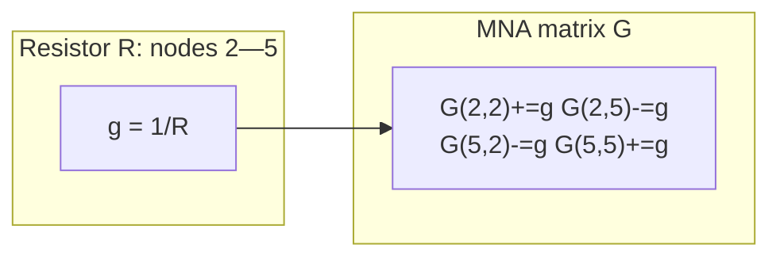

# Element Stamping

**Stamping** is the process of adding an element's contribution to the global Modified Nodal Analysis (MNA) matrix and right-hand side. Each device type has a small template that scatters values into row/column indices determined by its connecting nodes and any auxiliary branch current unknowns.

## Indexing convention

Label non-ground nodes $1, \ldots, n$. For a branch current unknown $i_b$ associated with element $k$, assign it index $n + k$ in the augmented unknown vector $\mathbf{x}$.

The MNA system is $\mathbf{A}\mathbf{x} = \mathbf{b}$ with

$$
\mathbf{A} =
\begin{bmatrix}
\mathbf{G} & \mathbf{B} \\\\
\mathbf{C} & \mathbf{D}
\end{bmatrix}, \quad
\mathbf{x} =
\begin{bmatrix}
\mathbf{v} \\ \mathbf{i}_b
\end{bmatrix}
$$

Stamping never rebuilds the matrix from scratch each iteration — it **accumulates** into preallocated sparse structures.

## Resistor

A resistor $R$ between nodes $p$ and $n$ has conductance $g = 1/R$.

**Stamp into $\mathbf{G}$:**

|       | col $p$ | col $n$ |
|-------|---------|---------|
| row $p$ | $+g$  | $-g$  |
| row $n$ | $-g$  | $+g$  |

No RHS contribution unless paired with a source network.

## Independent current source

A source $I_s$ from node $p$ toward node $n$ adds to the KCL RHS:

$$
b_p \mathrel{+}= I_s, \quad b_n \mathrel{-}= I_s
$$

## Independent voltage source

Between nodes $p$ (positive) and $n$ (negative), with branch current $i_s$:

**KVL row** (new row index $r$):

$$
A_{r,p} = +1,\quad A_{r,n} = -1,\quad b_r = V_s
$$

**KCL columns** for $i_s$:

$$
A_{p,r} = +1,\quad A_{n,r} = -1
$$

This symmetric $2\times2$ coupling pattern is the hallmark of voltage-source stamping.

## Voltage-controlled current source (VCCS)

Transconductance $g_m$, controlling nodes $c$ and $d$, output nodes $p$ and $n$:

$$
i_\text{out} = g_m (v_c - v_d)
$$

Stamp:

|       | col $c$ | col $d$ |
|-------|---------|---------|
| row $p$ | $+g_m$ | $-g_m$ |
| row $n$ | $-g_m$ | $+g_m$ |

No extra unknown — pure nodal stamp.

## Capacitor (companion model, backward Euler)

For transient analysis with timestep $\Delta t$, replace $C$ with:

- equivalent conductance $g_C = C / \Delta t$
- history current source $I_\text{eq}$

Between $p$ and $n$:

$$
G_{pp} \mathrel{+}= g_C,\quad G_{nn} \mathrel{+}= g_C,\quad G_{pn} \mathrel{-}= g_C,\quad G_{np} \mathrel{-}= g_C
$$

$$
b_p \mathrel{+}= I_\text{eq},\quad b_n \mathrel{-}= I_\text{eq}
$$

where $I_\text{eq} = g_C \cdot v_{pn}^{(n-1)}$ for the trapezoidal or backward-Euler companion (exact form depends on integration rule).

## Diode (Newton linearization)

Shockley equation:

$$
i_D = I_S \left(e^{v_D / (n V_T)} - 1\right)
$$

At iteration $k$, with $v_D^{(k)} = v_p^{(k)} - v_n^{(k)}$:

$$
g_d = \frac{di_D}{dv_D}\bigg|_{v_D^{(k)}} = \frac{I_S}{n V_T} e^{v_D^{(k)} / (n V_T)}
$$

$$
I_\text{eq} = i_D(v_D^{(k)}) - g_d \thinspace  v_D^{(k)}
$$

Stamp $g_d$ as a resistor between $p$ and $n$, and add $I_\text{eq}$ to the RHS (positive into node $p$).

## Stamp accumulation diagram

## Sparse matrix considerations

Real SPICE netlists may contain $10^6+$ elements. Stamping must be **O(1) per element**:

1. Precompute node-to-row maps during netlist parse.
2. Use compressed sparse column (CSC) or coordinate (COO) format; COO is often assembled then converted once per Newton iteration.
3. Reuse symbolic factorization when sparsity pattern is fixed (DC operating point); partial refactor for topology changes only.

## Stamp table summary

| Element | Extra unknown? | Touches blocks |
|---------|----------------|----------------|
| Resistor | No | $\mathbf{G}$ |
| Current source | No | RHS |
| Voltage source | Yes ($i_s$) | $\mathbf{B}, \mathbf{C}$ |
| VCCS | No | $\mathbf{G}$ |
| VCVS | Yes | $\mathbf{B}, \mathbf{C}$ + constraint |
| Capacitor (transient) | No | $\mathbf{G}$ + history RHS |
| Diode | No | $\mathbf{G}$ + nonlinear RHS |

Mastering stamping is the bridge between circuit theory on paper and the numerical kernel of any SPICE implementation.
